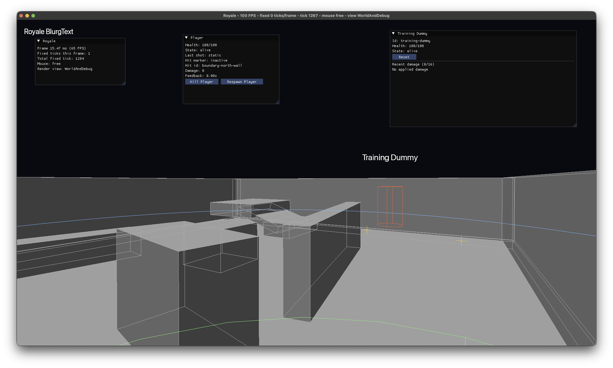

# Royale

Royale is an experimental cross-platform multiplayer battle royale built from the ground up in C# on .NET 10.

The goal is not to reproduce the scale or feature set of a commercial battle royale. The project exists to prove that a small custom technology stack can support a complete server-authoritative multiplayer match loop across macOS, Linux, and eventually Windows.

Current status: early prototype. The client can open an SDL3 window, render a gray-box world through SDL GPU, display ImGui diagnostics, run local first-person movement, use Box3D-backed collision helpers, fire a default hitscan rifle at a training dummy, and render BlurgText-based screen/world labels. Dedicated server, networking, battle-royale match flow, loot, packaging, and full cross-platform verification are still in progress.



## Goals

- Native macOS and Linux clients, with Windows planned later.
- A Linux dedicated server that runs headlessly without SDL windowing or GPU initialization.
- Server-authoritative movement validation, combat, health, ammunition, safe zone, match phases, eliminations, winner selection, and reset.
- Shared simulation and protocol libraries without weakening server authority.
- A focused game-specific renderer and platform layer, not a general-purpose engine.
- Incremental vertical slices that remain visible, testable, or playable.

## Technology

- .NET 10 and C#
- SDL3 for windowing, input, events, and platform integration
- SDL GPU for rendering
- Box3D through focused C# bindings and managed wrappers
- ImGui through SDL3 and SDL GPU backends for development tooling
- BlurgText for game-facing text outside ImGui
- WattleScript planned for automated gameplay scenarios

## Repository Layout

```text
src/
  Royale.Client/          SDL3 client, rendering, input, diagnostics
  Royale.Server/          Dedicated server entry point
  Royale.Simulation/      Shared movement, combat, collision, gameplay logic
  Royale.Protocol/        Protocol constants and future message definitions
  Royale.Content/         Shared map and weapon content
  Royale.Box3D.Bindings/  Low-level Box3D C API bindings
  Royale.Box3D/           Managed Box3D wrappers
  Royale.Native/          Native library resolution
  Royale.Diagnostics/     Shared logging

tests/                    xUnit tests by project area
thirdparty/               Pinned dependency fetch/build scripts and patches
.pm/                      Public PM board and wiki source of truth
```

## Prerequisites

- .NET SDK `10.0.301`, as pinned by `global.json`
- `git`
- `shadercross` on `PATH`
- CMake for native Box3D and BlurgText builds
- macOS ARM64 for the currently complete client native build path
- SDL3 development headers visible to `pkg-config` when building the ImGui SDL3/GPU shim on macOS

The native helper scripts currently focus on macOS ARM64, with some Linux build work present for Box3D. Linux and Windows client packaging are planned tasks, not completed release targets.

## Third-Party Dependencies

Third-party source is not committed as submodules. Pinned repositories are fetched into ignored directories under `thirdparty/repos/`, and project-specific changes belong in ordered patch files under `thirdparty/patches/`.

Fetch all pinned dependencies:

```sh
sh thirdparty/fetch-all.sh
```

Build the macOS ARM64 native artifacts currently needed by the client:

```sh
sh thirdparty/build-box3d-macos.sh
sh thirdparty/build-imgui-macos.sh
sh thirdparty/build-blurgtext-macos.sh
```

See `thirdparty/README.md` and the PM wiki pages under `.pm/wiki/third-party-dependencies/` for dependency policy, pins, layout, and patch workflow.

## Build And Test

Restore after fetching third-party source:

```sh
dotnet restore Royale.slnx -p:CI_DONT_TARGET_ANDROID=1
```

Build:

```sh
dotnet build Royale.slnx -m:1 --no-restore
```

Test:

```sh
dotnet test Royale.slnx -m:1 --no-restore
```

The `-m:1 --no-restore` flags are intentional for Codex/sandboxed sessions and are also fine for local deterministic builds after restore.

## Running The Client

Run the current client prototype:

```sh
dotnet run --project src/Royale.Client/Royale.Client.csproj -p:CI_DONT_TARGET_ANDROID=1 -- --offline --map graybox
```

Useful development controls:

- `F1` toggles relative mouse capture.
- `F2` toggles gameplay view and freecam.
- `F5` renders normal world solids.
- `F6` renders world solids plus debug wireframes.
- `F7` renders debug wireframes only.
- `F8` renders collision solids.
- `Escape` releases mouse capture before quitting.

The client also supports screenshot capture:

```sh
dotnet run --project src/Royale.Client/Royale.Client.csproj -p:CI_DONT_TARGET_ANDROID=1 -- --screenshot /tmp/royale-frame.bmp --screenshot-after-frames 5
```

Deterministic validation captures can start directly in freecam. Camera vectors use invariant-culture `x,y,z` floats and are accepted only with `--camera-mode freecam`:

```sh
dotnet run --project src/Royale.Client/Royale.Client.csproj -p:CI_DONT_TARGET_ANDROID=1 -- --offline --map graybox --camera-mode freecam --camera-position 4,2.2,3 --camera-look-at 1.75,0.7,-1.35 --screenshot /tmp/royale-crate.bmp --screenshot-after-frames 5
```

## Running The Server

The server project runs a headless fixed-timestep simulation, loads the selected map, and builds the server-owned Box3D static collision world without SDL, SDL GPU, ImGui, or client rendering dependencies:

```sh
dotnet run --project src/Royale.Server/Royale.Server.csproj -- --port 7777 --map graybox
```

For deterministic validation runs, provide a finite tick count:

```sh
dotnet run --project src/Royale.Server/Royale.Server.csproj -- --map graybox --run-ticks 5
```

Real networking, player state, and match flow are still planned work. See the PM board for current task state.

## Project Management And Documentation

This repository keeps its PM board and wiki in `.pm/`.

Important wiki entry points:

- `.pm/wiki/project-overview.md`
- `.pm/wiki/architecture.md`
- `.pm/wiki/third-party-dependencies.md`
- `.pm/wiki/diagnostics.md`

Agent workflow and repository rules are documented in `AGENTS.md`. PM storage should be changed through PM tools, not by manually editing `.pm` task or wiki files.

## License

This project is licensed under the MIT License. See `LICENSE`.

Third-party dependencies retain their own licenses and notices. Distribution or packaging work must carry the required upstream notices for bundled native and managed dependencies.
